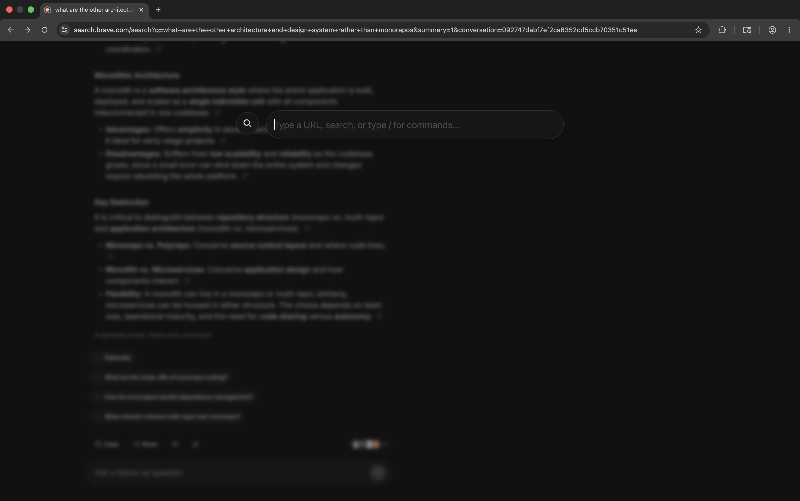
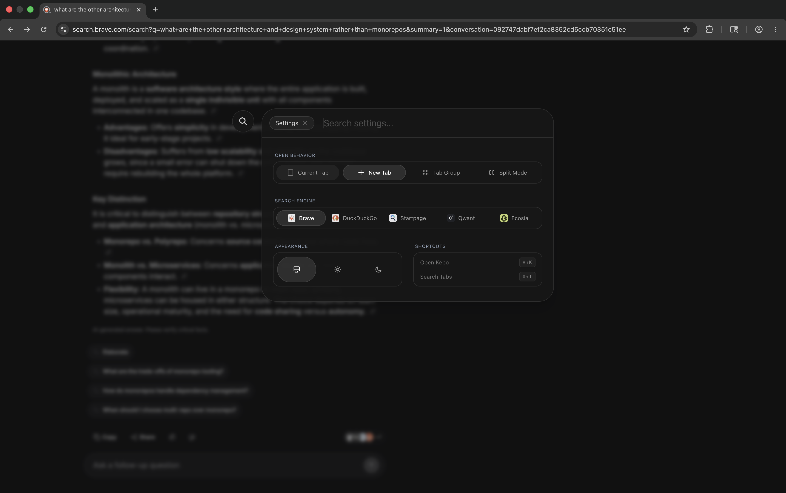
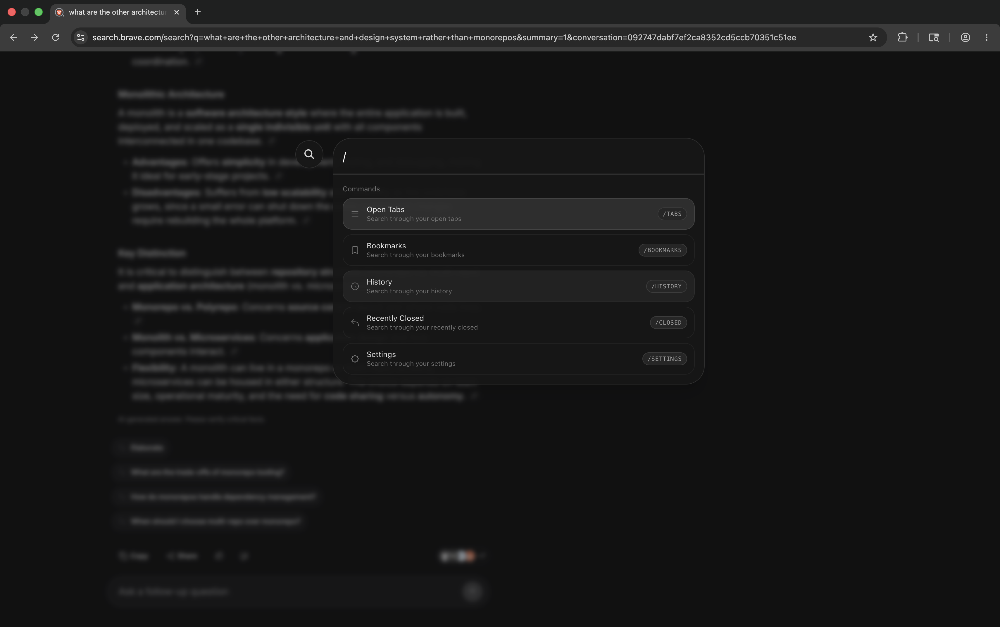

# Kebo

A beautifully crafted, Spotlight-style command bar for your browser. Kebo lets you navigate your tabs, bookmarks, and history at lightning speed, entirely via keyboard.

## Features

- **Blazing Fast Navigation**: Jump between your open tabs, search your history, or find your bookmarks instantly.
- **Spotlight-Style UI**: A gorgeous, minimalist interface that feels native and premium.
- **Customizable Search Engines**: Quickly search the web with your favorite engine (Brave, DuckDuckGo, Startpage, Qwant, Ecosia).
- **Dark & Light Modes**: Beautifully designed themes that respect your system preferences.
- **Keyboard-First Design**: Everything is accessible without touching your mouse (`Cmd+Shift+K` to open Kebo, `Cmd+Shift+T` to search tabs).

## Screenshots







## Keyboard Shortcuts

Kebo relies entirely on your keyboard for maximum efficiency. By default:
- `Cmd+Shift+K`: Open Kebo Command Bar
- `Cmd+Shift+T`: Search your Tabs

> [!WARNING]
> **Shortcut Conflicts**
> When configuring custom shortcuts, be aware that some key combinations may conflict with your operating system, other installed desktop applications, or specific websites. If a shortcut isn't triggering Kebo, try assigning a different key combination via `chrome://extensions/shortcuts`.

## Getting Started

To run Kebo locally:

```bash
# Install dependencies
bun install

# Start development server
bun run dev
```

## Built With

- [WXT](https://wxt.dev/) - Next-gen framework for browser extensions.
- React & TypeScript - Robust UI development.
- Tailwind CSS - Sleek, utility-first styling.
